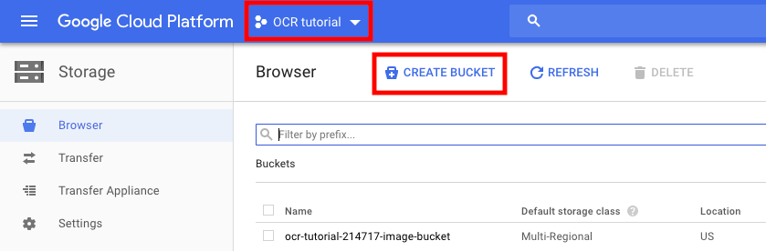
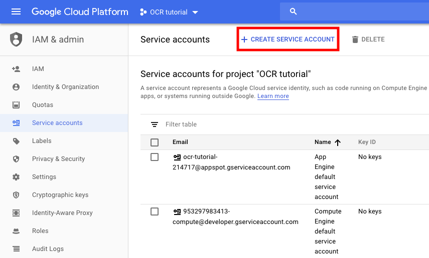
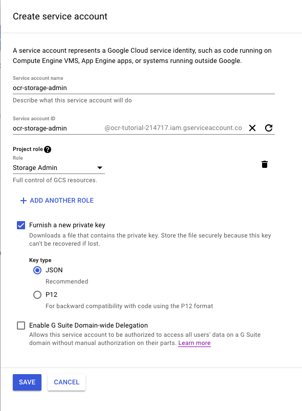
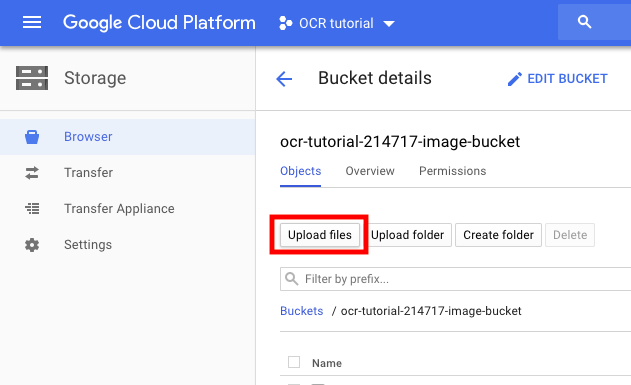

# Part 1: Setting Up Google Cloud

## Step 1: Create a Google Cloud account
If you haven't created a Google Cloud account before, register for a new account with $300 of credits for 1 year [here](https://console.cloud.google.com/freetrial). 

## Step 2: Provision Google Cloud resources
Create a new Google Cloud project from the [cloud resource manager](https://console.cloud.google.com/cloud-resource-manager). More information [here](https://cloud.google.com/resource-manager/docs/creating-managing-projects).

Create a new Google Cloud bucket from the [storage browser](https://console.cloud.google.com/storage/browser). Make sure the project you just created is selected as shown in the image below:



Remember the name of your bucket, this will be important later.

## Step 3: Set up authentication protocol
A service account is distinguished from the Google Cloud account you created to get free credits. Create a new service account for your newly created Google Cloud project [here](https://console.cloud.google.com/iam-admin/serviceaccounts) by clicking the "+ CREATE SERVICE ACCOUNT" button. Again, make sure the correct project is selected.



Name your account, add the "Storage - Storage Admin" role and select the "Furnish a new private key" with a JSON key type. Click "Save" and your key should download. Avoid sharing this key as it provides administrative privileges to your storage buckets on Google Cloud!



More information on creating a service account found [here](https://cloud.google.com/iam/docs/creating-managing-service-accounts#creating_a_service_account).

Now set the `GOOGLE_APPLICATION_CREDENTIALS` environment variable in your terminal to authenticate using Application Default Credentials.

From Google's documentation:

>If you're using a client library to call the Vision API, use Application Default Credentials (ADC). Services using ADC look for credentials within a `GOOGLE_APPLICATION_CREDENTIALS` environment variable. Unless you specifically wish to have ADC use other credentials (for example, user credentials), we recommend you set this environment variable to point to your service account key file.

`export GOOGLE_APPLICATION_CREDENTIALS=PATH_TO_KEY_FILE`

>Replace `PATH_TO_KEY_FILE` with the path to your JSON service account file (directory and filename). `GOOGLE_APPLICATION_CREDENTIALS` should be written out as-is (it's not a placeholder in the example above).

If you don't know what the path to your key file is and you are using a Mac, `~/Downloads/FILENAME` where `FILENAME` is the full name of the file that downloaded automatically after you created the service account.


# Part 2: Download libraries and the OCR script

## Step 1: Install the Google Cloud Python library 
Install the Python API library for Google Cloud Vision with the following command in your terminal:

    pip3 install --upgrade google-cloud-vision

Then install the Google Cloud Storage library with:

    pip3 install --upgrade google-cloud-storage

## Step 2: Download the `transcribe.py` script in this repository
You can either right click the link to `transcribe.py` and hit "Save As" or download the entire repository as a .zip from the "Clone or download" button shown in the image below.


# Part 3: Upload OCR target files and launch script

## Step 1: Upload desired files to your Google Storage bucket
Upload a .pdf or .tiff file you wish to transcribe using the web client found [here](https://console.cloud.google.com/storage/browser)



## Step 2: Launch script
Navigate to the directory containing the `transcribe.py` script downloaded earlier and launch script with:

    python3 transcribe.py --filepath CLOUD_PATH --bucket BUCKET_NAME

Where `CLOUD_PATH` is a placeholder and should be replaced with the path to your file within the Google Storage bucket (just the full filename e.g. "book.pdf" if uploaded in the previous step without creating any intermediate directories in the bucket). 

And `BUCKET_NAME` is a placeholder and should be replaced with the full name of the storage bucket (without the "gs://" prefix).

If your target file is a .tiff instead of a .pdf, simply add the tiff flag like so:

    python3 transcribe.py --filepath CLOUD_PATH --bucket BUCKET_NAME --tiff

If your target file is an image file instead of a .tiff or .pdf, use the `transcribe_image.py` script instead:

    python3 transcribe_image.py --filepath CLOUD_PATH --bucket BUCKET_NAME

In either of these scripts, you can optionally specify an output directory for the .txt file with the `--output-dir OUTPUT_DIR` flag appended to your command, where `OUTPUT_DIR` is replaced with the path to your desired output directory.

## Transcribing Tibentan documents
```bash
export GOOGLE_APPLICATION_CREDENTIALS=/path/to/credentials

./transcribe.sh
```

## Appendix A: Convert PDF to JPG (locally)
Currently there are some bugs with Google Cloud Vision's transcribe pdf function that breaks on some pdf files. A current workaround is to convert each page of a problematic pdf to a jpg image file and then run the `transcribe_image.py` script from Step 2.

First install some additional dependencies.

Mac installation:
If you know you have homebrew (also known as brew) installed, skip this next step. 

Install homebrew by entering the following command in a terminal prompt:

    /usr/bin/ruby -e "$(curl -fsSL https://raw.githubusercontent.com/Homebrew/install/master/install)"

Now install the python library `pdf2image` with pip:

    pip3 install pdf2image

Windows installation:
Follow instructions (here)[http://blog.alivate.com.au/poppler-windows/] then add the `bin` folder to your PATH.

Now we can run the `pdf_to_jpg.py` conversion script on a local .pdf file as follows:

    python3 pdf_to_jpg.py --filepath FILE_PATH

As with `transcribe.py` and `transcribe_image.py` above, you can optionally specify an output directory for your .jpg files with `--output-dir OUTPUT_DIR` appended to your command. If an ouput directory is not explicitly specified, the jpg files are by default dumped to the same directory that the .pdf file is found in.

## Appendix B: Convert PDF to JPG (streamlined)
The process described in appendix A requires running `transcribe_image.py` individually on each page of a book, and outputs many .txt files. Instead, it would be much easier to automate the process of iterating through all images constituting a converted pdf file, running document text detection on each image, and then collecting the output into one file.

We accomplish that with two scripts: `pdf_to_jpg_dir.py`, which converts a pdf file to multiple jpg files and then uploads all the jpg files into a directory in the user-specified Google Cloud Storage bucket, and `transcribe_image_dir.py`, which runs document text detection on all files in a user-specified Google Cloud Storage directory and writes all text output to a single .txt file.

To use the `pdf_to_jpg_dir.py` script:

    python3 pdf_to_jpg_dir.py --filepath FILE_PATH --bucket BUCKET_NAME

where `FILE_PATH` should be replaced by the local path to the pdf file to be converted and `BUCKET_NAME` should be replaced by the GCS bucket name. Finally, we have the option of appending `--output-dir OUTPUT_DIR` with OUTPUT_DIR replaced by the desired name of the Google Cloud Storage output directory storing all the image files.

To use the `transcribe_image_dir.py` script:

    python3 transcribe_image_dir --filepath FILE_PATH --bucket BUCKET_NAME

where `FILE_PATH` should be replaced by the GCS path to the directory containing all image files to be transcribed and `BUCKET_NAME` should be replaced by the GCS bucket name. Optionally, we may also append `--output-dir OUTPUT_DIR` to our command to specify the name of a local output directory to hold our single output .txt file.

## Appendix C: FAQ

```
AttributeError: module 'google.cloud.vision' has no attribute 'types'
```

Not sure what the root cause of this is, maybe Google changed their cloud vision API after this tutorial was written, but if you encounter this issue, you need to replace all instances of `vision.types` with just `vision` e.g. `vision.types.Feature` -> `vision.Feature`. 

---

```
AttributeError: Unknown field for AnnotateFileResponse: DESCRIPTOR
```

Again, not sure what the root cause of this is, maybe Google changed their cloud vision API after this tutorial was written, but if you encounter this issue, you need to replace any calls to
```
json_format.Parse(json_string, vision.AnnotateFileResponse())
```
with
```
json_format.Parse(json_string, vision.AnnotateFileResponse()._pb)
```
i.e. make sure to use the `._pb` (protocol buffer) property of a file response.

For more information, see https://stackoverflow.com/questions/64403737/attribute-error-descriptor-while-trying-to-convert-google-vision-response-to-dic

---

```
UnicodeEncodeError: 'charmap' codec can't encode characters in position 0-15: character maps to <undefined>
```

Need to specify the encoding for non-English languages.

For more information, see https://stackoverflow.com/questions/27092833/unicodeencodeerror-charmap-codec-cant-encode-characters
